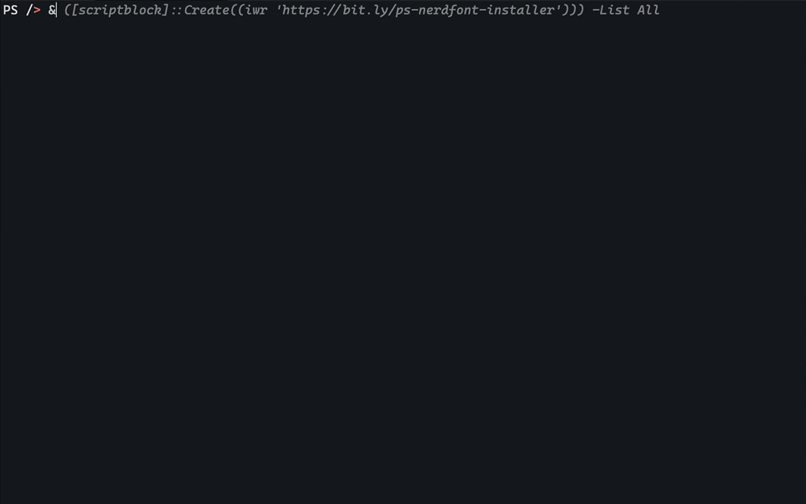

# How to Enhance Your PowerShell Terminal Experience in Dev Containers

Your Dev Container (or Codespace) uses the [`powershell-extended`](https://github.com/jpawlowski/devcontainer-features/tree/main/src/powershell-extended)
feature which provides a great out-of-box experience for your PowerShell.

Some advanced visual features depend on the availability of a Nerd Font, which are fonts that are extended with special characters
to display glyphs/icons and other graphics right in your terminal window.

By installing such font and tweaking some settings of your Dev Container and Visual Studio Code settings, you unlock the
best experience for your PowerShell terminal.

## 1. Install Nerd Font

Since the Visual Studio (not Code) default font is _Cascadia Code_, we recommend to use it in VSCode as well. In
[May 2024 release](https://github.com/microsoft/cascadia-code/releases/tag/v2404.23) it received native Nerd Font support
with all the nice details we care about. Since it is not bundles with VSCode (yet), you will need to install it separately.

If you wish, you may also select any other font from [nerdfonts.com](https://www.nerdfonts.com/).

### Install _Cascadia Code_ & _Cascadia Mono_ font families as your Nerd Font _(recommended)_

1. **Open new VSCode window**:
   - In Visual Studio Code (VSCode), open a new window: `File > New Window`.
   - _Alternatively_, you may also open a PowerShell session in your favorite terminal app and skip next step no. 2.
     If you are on Windows, it is preferable to use PowerShell 7 (`pwsh.exe`) rather than
     Windows PowerShell 5.1 (`powershell.exe`). PowerShell 7 is the cross-platform version that is actively maintained and
     updated, whereas Windows PowerShell is the legacy version built into Windows.

2. **Start a new PowerShell session**:
   - You can do this by opening the command palette
     (`Cmd + Shift + P` on Mac or `Ctrl + Shift + P` on Windows/Linux) and selecting
     `Terminal: Create New Terminal (With Profile)`.
   - Select `pwsh` from the menu. On Windows, it is preferable to use PowerShell 7 (`pwsh.exe`) rather than
     Windows PowerShell 5.1 (`powershell.exe`). PowerShell 7 is the cross-platform version that is actively maintained
     and updated, whereas Windows PowerShell is the legacy version built into Windows.

3. **Run the Nerd Font installer script in direct install mode**:
   - Copy & paste the following code into the terminal window:

     ```powershell
     & ([scriptblock]::Create((iwr 'https://bit.ly/ps-nerdfont-installer'))) -Name cascadia-code, cascadia-mono
     ```
   - Press `Enter` to run the code.

4. **Confirm installation**:
   - You will see the following output to confirm the installation:

     ```console
     Nerd Fonts Installation
     Do you confirm to install 'Cascadia Code Font Family' from github.com/microsoft/cascadia-code ?
     [Y] Yes  [A] Yes to All  [N] No  [L] No to All  [S] Suspend  [?] Help (default is "Y"): 
     ```

   - Type `A` and press `Enter` to continue with the installation.

After this, you may continue with [step 2](#2-change-your-font-settings-in-vscode), or install additional fonts as
described below.

### Get an interactive menu to select a Nerd Font to install _(optional)_

1. **Open new VSCode window**:
   - In Visual Studio Code (VSCode), open a new window: `File > New Window`.
   - _Alternatively_, you may also open a PowerShell session in your favorite terminal app and skip next step no. 2.
     If you are on Windows, it is preferable to use PowerShell 7 (`pwsh.exe`) rather than
     Windows PowerShell 5.1 (`powershell.exe`). PowerShell 7 is the cross-platform version that is actively maintained and
     updated, whereas Windows PowerShell is the legacy version built into Windows.

2. **Start a new PowerShell session**:
   - You can do this by opening the command palette
     (`Cmd + Shift + P` on Mac or `Ctrl + Shift + P` on Windows/Linux) and selecting
     `Terminal: Create New Terminal (With Profile)`.
   - Select `pwsh` from the menu. On Windows, it is preferable to use PowerShell 7 (`pwsh.exe`) rather than
     Windows PowerShell 5.1 (`powershell.exe`). PowerShell 7 is the cross-platform version that is actively maintained
     and updated, whereas Windows PowerShell is the legacy version built into Windows.

3. **Run the Nerd Font installer script in interactive mode**:
   - Copy & paste the following code into the terminal window:

     ```powershell
     & ([scriptblock]::Create((iwr 'https://bit.ly/ps-nerdfont-installer')))
     ```
   - Press `Enter` to run the code.

4. **Select Nerd Font**:
   - You will see a selection menu like this:

     

   - Enter a number corresponding to the list of Nerd Font names. To choose your favorite,
     you may want to visit [nerdfonts.com](https://www.nerdfonts.com/) for a preview. Depending on your PowerShell version
     and availability, there may also be an `↗` upwards arrow you may click on.

   - Press `Enter` to confirm your selection.

4. **Confirm installation**:
   - You will see the following output to confirm the installation:

     ```console
     Your selected font: Meslo

     Nerd Fonts Installation
     Do you confirm to install 'Meslo' from GitHub.com/ryanoasis ?
     [Y] Yes  [A] Yes to All  [N] No  [L] No to All  [S] Suspend  [?] Help (default is "Y"):
     ```

   - Press `Enter` to continue with the installation, or repeat the steps to install more fonts.

After this, continue with [step 2](#2-change-your-font-settings-in-vscode).

## 2. Change your font settings in VSCode

To change the font settings in Visual Studio Code (VSCode) for both the code editor and the terminal, follow these steps:

### Changing the Font for the Code Editor

1. **Open Settings**:
   - Press `Cmd + ,` or go to `File > Preferences > Settings`.

2. **Search for Font Settings**:
   - In the search bar at the top, type `font`.

3. **Edit Font Family**:
   - Look for the setting named `Editor: Font Family`.
   - Click on `Edit in settings.json` or directly edit the text box to add your desired font before the existing ones.
   For example:

     ```json
     "editor.fontFamily": "'Cascadia Code NF', Consolas, 'Courier New', monospace"
     ```

     Note that font names with multiple words should be put into single quotes (`'`).

   - **Enable Font Ligatures** _(optional)_:

     If your font supports [ligatures](https://www.hanselman.com/blog/monospaced-programming-fonts-with-ligatures), you
     may optionally enable these to give you some (potentially) nice typographic enhancements in the editor :

     ```json
     "editor.fontLigatures": true,
     ```

     Ultimately, the choice is yours. Some people appreciate it, while others do not. It's best to form your own opinion.
     If you have an interest in typography, you might enjoy it. However, if you prefer sticking to standards, you might not.
     It's a balance between the artist and the nerd within you.

4. **Save Settings**:
   - Save the changes if you edited the `settings.json` file.

### Changing the Font for the Integrated Terminal _(optional)_

Usually, the terminal font is inherited from the editor font settings. You may optionally set a different font for the
terminal like this:

1. **Open Settings**:
   - Press `Cmd + ,` or go to `File > Preferences > Settings`.

2. **Search for Terminal Font Settings**:
   - In the search bar at the top, type `terminal font`.

3. **Edit Terminal Font Family**:
   - Look for the setting named `Terminal > Integrated: Font Family`.
   - Click on `Edit in settings.json` or directly edit the text box to add your desired font. For example:
     ```json
     "terminal.integrated.fontFamily": "'Cascadia Mono NF', 'Courier New', monospace"
     ```

4. **Save Settings**:
   - Save the changes if you edited the `settings.json` file.

By following these steps, you can customize the fonts used in both the code editor and the integrated terminal in VSCode
to your preferred Nerd Font or any other font.

## 3. Change your _Oh My Posh_ PowerShell prompt

Now that you have installed a super nerdy font, you are ready to change your prompt to something more pleasing.

There is a selected preview of options on the [Oh My Posh site](https://ohmyposh.dev/docs/themes), and many more out there
in the depths of the internet like the [community discussions](https://github.com/JanDeDobbeleer/oh-my-posh/discussions/categories/themes).

To change the prompt to something of your taste, follow these steps:

### Changing the _Oh My Posh_ theme in your `devcontainer.json`

1. **Open `devcontainer.json`**:
   - In the file explorer of VSCode, open the `.devcontainer` folder and click on the `.devcontainer.json` file to open it.

2. **Search for `remoteEnv` section**:
   - Find the `remoteEnv` section in the bottom part of the file.
   - If it does not exist, you may create an empty section like this:
     ```jsonc
     // ...
     "remoteEnv": {

     }
     // ...
     ```

     If you are strugging to find the right spot, you may follow the [video instructions from the VSCode website](https://code.visualstudio.com/remote/advancedcontainers/environment-variables).

3. **Change environment variables**:
   - Now you want to change (or add) the environment variables shown below:

     ```jsonc
     // ...
     "remoteEnv": {
        // Set theme for regular PowerShell session
        "PSPROFILE_POSH_THEME": "devcontainers.minimal.omp.json",

        // Set theme for PowerShell Extension session
        "PSPROFILE_VSCODE_POSH_THEME": "devcontainers.minimal.omp.json"
     },
     // ...
     ```

     Note that you will need to pay attention to keep a valid JSON format which might require adding some commas `,` at
     the end of a section or existing environment variables.

     You may either enter the name of one of the included themes, or set a direct URL to download the theme automatically.

4. **Save `devcontainer.json`**:
   - Save the changes.

5. **Restart your dev container**:
   - To apply the changes, you need to restart your dev container. You can do this by opening the command palette
   (`Cmd + Shift + P` on Mac or `Ctrl + Shift + P` on Windows/Linux) and selecting `Dev Containers: Reopen Folder Locally`.
     If your container wasn't running, you may now simply start it again. Search for `Dev Containers: Reopen in Container`
     to start the Dev Container with the new settings.

   - **Note**: This procedure is similar for GitHub Codespaces. Open the command palette and select
     `Codespaces: Stop current Codespace`. Then, search for `Codespaces: Connect to Codespace` to start the Codespace with
     the new settings.

By following these steps, you can customize your _Oh My Posh_ PowerShell prompt to your liking.
