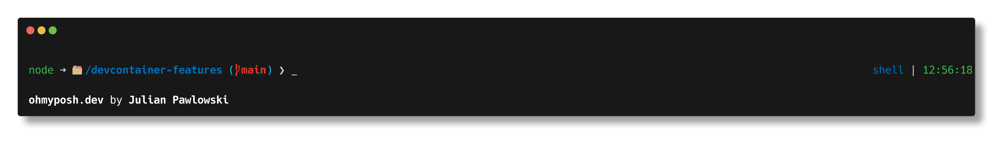

### **IMPORTANT NOTE**
- **Ids used to publish this Feature in the past - 'powershell'**

# PowerShell Extended [PSResourceGet / NuGet Versioning; Oh My Posh prompt profile] (powershell-extended)

Installs PowerShell on AMD64 and ARM64 architectures, with optional resources from the PowerShell Gallery via PSResourceGet. Includes a custom Oh My Posh terminal prompt theme and customizable profile files. Supports advanced installation options for PowerShell modules and scripts.

## Example Usage

```json
"features": {
    "ghcr.io/jpawlowski/devcontainer-features/powershell-extended:2": {}
}
```

## Options

| Options Id | Description | Type | Default Value |
|-----|-----|-----|-----|
| version | Select or enter a version of PowerShell. Defaults to `latest`. | string | latest |
| installMethod | Select the installation method for PowerShell. If you choose `package`, PowerShell will be installed using the package manager with a fallback to 'github'. If you choose `github`, PowerShell will be installed from GitHub releases. | string | package |
| updatePSResourceGet | Update built-in [`Microsoft.PowerShell.PSResourceGet`](https://github.com/PowerShell/PSResourceGet) module to the latest version before installing additional resources. Defaults to `release`. | string | release |
| updatePSReadLine | Update built-in [`PSReadLine`](https://github.com/PowerShell/PSReadline) module to the latest version. Defaults to `release`. | string | release |
| updateModulesHelp | Update help files for installed modules? Defaults to `true`. | boolean | true |
| setUserDefaultShell | Change default shell for non-root user to PowerShell? Note that this might impact [`userEnvProbe`](https://containers.dev/implementors/json_reference/#general-properties) performance. Consider setting [`terminal.integrated.defaultProfile.*`](https://code.visualstudio.com/docs/terminal/profiles) instead. Defaults to `false`. | boolean | false |
| setRootDefaultShell | Change default shell for root to PowerShell? Note that this might impact [`userEnvProbe`](https://containers.dev/implementors/json_reference/#general-properties) performance. Consider setting [`terminal.integrated.defaultProfile.*`](https://code.visualstudio.com/docs/terminal/profiles) instead. Defaults to `false`. | boolean | false |
| repositories | Optional semicolon separated list of PowerShell repositories to register. To set a specific name for a repository, use the format `name=url`, otherwise the name will be the base URL. See feature documentation for more information about advanced installation options. | string | - |
| resources | Optional semicolon separated list of PowerShell resources to install. If you need to install a specific version, use `@` to specify the version (e.g. `Az.Accounts@3.1.0`). See feature documentation for more information about advanced installation options. | string | - |
| installOhMyPosh | Install Oh My Posh? Defaults to `true`. | boolean | true |
| installOhMyPoshConfig | Allow installing the default dev container profile templates? Defaults to `true`. May be tweaked by setting `containerEnv.PSPROFILE_*` variables. | boolean | true |
| profileURLAllUsersAllHosts | Optional (publicly accessible) URL to download global [PowerShell profile](https://learn.microsoft.com/en-us/powershell/module/microsoft.powershell.core/about/about_profiles) (AllUsersAllHosts). Defaults to `""`. Note that this will take precedence over `installOhMyPoshConfig` for the global profile. | string | - |
| psConfigURLAllUsersAllHosts | Optional (publicly accessible) URL to download global [PowerShell config](https://learn.microsoft.com/en-us/powershell/module/microsoft.powershell.core/about/about_powershell_config) (AllUsersAllHosts) in JSON format. Defaults to `""`. | string | - |
| psConfigExperimentalFeatures | Optional semicolon separated list of [experimental PowerShell features](https://learn.microsoft.com/en-us/powershell/scripting/learn/experimental-features) to enable in the global PowerShell config. Defaults to `""`. | string | - |

## Customizations

### VS Code Extensions

- `ms-vscode.powershell`

## Enhanced Shell Experience

The `installOhMyPoshConfig` setting installs a pre-configured set of [PowerShell profile files](./dotfiles/.config/powershell/)
that provide a fully-featured and ready-to-go terminal console experience.

> Follow the [Enhancement Guide](ENHANCEMENTS.md) to unlock the full potential of the PowerShell terminal in your Dev Container.

Here are some highlights:

### 1. Terminal Prompt Theme

This feature includes a custom [Oh My Posh](https://ohmyposh.dev/) theme to customize the terminal prompt.
[](./dotfiles/.config/oh-my-posh/themes/devcontainers.minimal.omp.json)
You can [change the theme](ENHANCEMENTS.md#3-change-your-oh-my-posh-powershell-prompt) to one that you prefer.

> **Note**: Most other themes require installing a [Nerd Font](https://ohmyposh.dev/docs/installation/fonts) on your
> **host system** (not the Dev Container) and adjusting your font settings in VSCode. The Windows Terminal default font
> [_Cascadia Code_](https://github.com/microsoft/cascadia-code/releases/tag/v2404.23) now has a native Nerd Font variant,
> which can [easily be installed](ENHANCEMENTS.md#1-install-nerd-font) and looks great in VSCode as well.

### 2. Command Line Completion / IntelliSense

Command completion is crucial for productivity when using the command line. The profile includes multiple popular completions
enabled out-of-the-box:

- [Azure CLI](https://learn.microsoft.com/en-us/cli/azure/) (also see [devcontainers/features/azure-cli](https://github.com/devcontainers/features/tree/main/src/azure-cli))
- [GitHub CLI](https://cli.github.com/) (also see [devcontainers/features/github-cli](https://github.com/devcontainers/features/tree/main/src/github-cli))
- [`Posh-Git`](https://github.com/dahlbyk/posh-git): Tab completion support for common git commands, branch names, paths
  and more.
- [`Microsoft.PowerShell.UnixTabCompletion`](https://github.com/PowerShell/UnixCompleters): PowerShell parameter completers
  for native commands on Linux and macOS.
- `PSReadLine` [Predictive IntelliSense](https://learn.microsoft.com/en-us/powershell/scripting/learn/shell/using-predictors)
  plugins:
  - [`CompletionPredictor`](https://learn.microsoft.com/en-us/powershell/scripting/learn/shell/using-predictors?view=powershell-7.4#using-other-predictor-plug-ins):
    Command-line IntelliSense based on PowerShell auto-completion.

Optional completions that can be enabled:

- [`Az.Tools.Predictor`](https://learn.microsoft.com/en-us/powershell/azure/predictor-overview): Module providing
  recommendations for cmdlets in the `Az` module.
- [Oh My Posh CLI](https://ohmyposh.dev/blog/whats-new-2#cli-interface-also-2)
- [`PSFzf`](https://github.com/kelleyma49/PSFzf): A PowerShell module that wraps `fzf`, a fuzzy file finder for the
  command line.

Other tools:

- [`z`](https://github.com/badmotorfinger/z): Lets you quickly navigate the file system in PowerShell based on your `cd`
  command history.
- Custom `dir` command alias to sort folders first and show hidden files.

### 3. Other Highlights

- **Fully Customizable Profile Configuration**:

  Profile presets can be adjusted using `PSPROFILE_*` environment variables directly in your `devcontainer.json`. Settings
  can be controlled separately for both regular PowerShell terminals and the VSCode PowerShell Extension host.

  Custom profile settings can be placed in profile directories to avoid modifying the built-in profile files. This includes
  separate directories for special terminal multiplexers like `tmux`.

- **Fast Profile Load Time**:

  The profile uses delayed and parallel module imports to enhance load times. This approach provides a feature-rich terminal
  experience while maintaining quick responsiveness when opening a new terminal window.

- **Daily Update of Help Files**:

  A background job automatically updates help files once a day when a new shell is started.

## Advanced Resource Installation Options

This is a re-write of the original [ghcr.io/devcontainers/features/powershell](https://ghcr.io/devcontainers/features/powershell)
package. It uses [Microsoft.PowerShell.PSResourceGet](https://learn.microsoft.com/en-us/powershell/module/microsoft.powershell.psresourceget/)
instead of [PowerShellGet](https://learn.microsoft.com/en-us/powershell/gallery/overview) to install resources, which is
included with PowerShell since version 7.4.0.

The new configuration options support an advanced syntax for 3rd party installation repositories as well as enhanced version
definition, including version ranges and pre-releases.

### Setting a version for `resources`

To use advanced options for resource installation, you may do so using the extended
resource name syntax:

`[<Repository-URI>]Resource-Name[@<Version>]`

#### Version Examples

| Notation                                     | Description                                                                                                                            |
| -------------------------------------------- | -------------------------------------------------------------------------------------------------------------------------------------- |
| `Az`                                         | Installs the latest version.                                                                                                           |
| `Az@12.1.0`                                  | Install exactly version 12.1.0.                                                                                                        |
| `Az@[12.1.0,]`                               | Installs any version equal or greater than 12.1.0.                                                                                     |
| `Az@[12.1,12.2)`                             | Installs the latest bugfix release within the 12.1.x range.                                                                            |
| `https://example.com/api/v2/MyPrivateModule` | Installs a module from a 3rd-party repository. The URI base is interpreted as resource name, while the rest is used as repository URI. |

For a detailled description about version formats, see [`Install-PSResource -Version`](https://learn.microsoft.com/en-us/powershell/module/microsoft.powershell.psresourceget/install-psresource?#-version)
reference.

Resource repositories are automatically created using their domain, unless they are pre-defined with their name
(see below). Note that these repositories will be available also after the container was created, but they will
**not be trusted** automatically after the initial installation of resources.

> **IMPORTANT:** Please note that multiple items must be separated using a semicolon (`;`).
> The comma is reserved to be used within version ranges as explained above.
> For example: `Az@12.1.0; Microsoft.Graph@2.20.0`

### Setting resource `repositories`

To register a resource repository (or change PSGallery default repository), you make use this syntax:

`[<Repository-Name>=]Repository-URI[^<Priority>]`

#### Resource Repository Examples

| Notation                                    | Description                                                  | Resulting Repository Name |
| ------------------------------------------- | ------------------------------------------------------------ | ------------------------- |
| `https://example.com/api/v2`                | Minimum example.                                             | `example.com`             |
| `MyRepo=https://example.com/api/v2`         | Setting an explicit repository name.                         | `MyRepo`                  |
| `https://www.poshtestgallery.com/api/v2^70` | Add PowerShell Test Gallery with a decreased priority of 70. | `www.poshtestgallery.com` |
| `PSGallery^60`                              | Decrease priority of PSGallery to 60.                        | `PSGallery`               |
| `PSGallery`                                 | Set PSGallery as trusted.                                    | `PSGallery`               |

Note that every repository you explicitly set in the configuration will automatically be configured as a **trusted resource**.

> **IMPORTANT:** Please note that multiple items must be separated using a semicolon (`;`).
> It follows the principle used to separate items in the `resources` option.
> For example: `PSGallery; PoshTestGallery=https://www.poshtestgallery.com/api/v2^70`


---

_Note: This file was auto-generated from the [devcontainer-feature.json](https://github.com/jpawlowski/devcontainer-features/blob/main/src/powershell-extended/devcontainer-feature.json).  Add additional notes to a `NOTES.md`._
